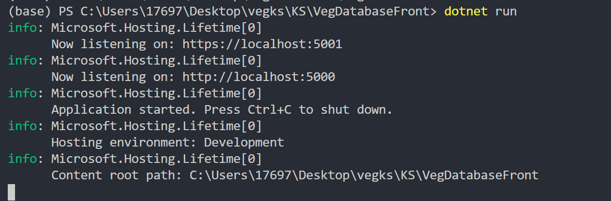

# VEGKS系统说明
## 依赖
系统：win x64  
环境：dotnet SDK 3.1+  [（下载地址）](https://dotnet.microsoft.com/download/dotnet-core/3.1)  

## 运行方法
打开powershell/cmd，来到[KS\VegDatabaseFront](KS\VegDatabaseFront)目录，运行
```cmd
dotnet run
```
看到即运行成功